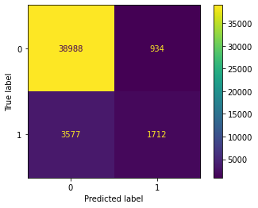
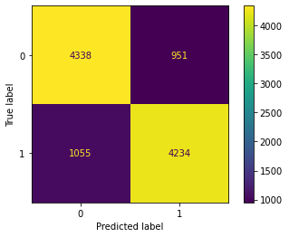
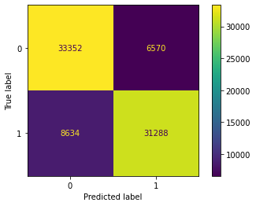
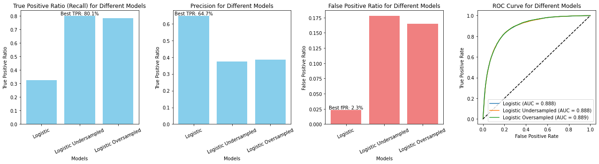

### Assignment 2: Julio Candela

### Previous code - ML-10 Example - Direct marketing of term deposits


```python
## [ML-10]  Example - Direct marketing of term deposits ##

# Importing the data #
import pandas as pd
path = 'https://raw.githubusercontent.com/mikecinnamon/Data/main/'
df = pd.read_csv(path + 'deposit.csv', index_col=0)
df['deposit'].mean().round(3)

# Q1. Logistic regression model #
y = df['deposit']
X = df.drop(columns='deposit')
from sklearn.linear_model import LogisticRegression
clf = LogisticRegression(max_iter=2000)
clf.fit(X, y)
y_pred = clf.predict(X)
conf = pd.crosstab(y, y_pred)
conf
acc = (y == y_pred).mean().round(3)
acc1 = y_pred[y == 1].mean().round(3)
acc0 = (1 - y_pred[y == 0]).mean().round(3)
acc, acc1, acc0

```


    (0.9, 0.324, 0.977)


```python
## Utilities
from sklearn.metrics import confusion_matrix
def train_model_score(model, X,y):
    model.fit(X,y)
    y_pred = model.predict(X)
    y_pred_proba = model.predict_proba(X)
    conf = confusion_matrix(y, y_pred)
    tp = conf[1, 1]/sum(conf[1, :])
    fp = conf[0, 1]/sum(conf[0, :])
    accuracy=(y==y_pred).mean()
    
    
    print("True positive rate (recall): ", round(tp,3))
    print("Precision: ", round(conf[1, 1]/sum(conf[:, 1]),3))
    print("False positive rate: ", round(fp,3))
    print("Accuracy: ", round(accuracy,3))
   
    return y_pred, conf, tp,fp
```

### Old model re training


```python
# Old model
## Training the model
from sklearn.linear_model import LogisticRegression

log = LogisticRegression(max_iter=2000)
y_pred, conf, tp, fp = train_model_score(log, X,y)

```

    True positive rate (recall):  0.324
    Precision:  0.647
    False positive rate:  0.023
    Accuracy:  0.9
    


```python
from sklearn.metrics import ConfusionMatrixDisplay
import matplotlib.pyplot as plt
cm_display = ConfusionMatrixDisplay(confusion_matrix = conf, display_labels = [0, 1])
cm_display.plot()
plt.show()
```


    

    


### Questions for the Assignment


```python
import numpy as np
print(f"Number of rows: {len(X):.0f}")
print(f"Conversion rate: {np.mean(y) * 100:.2f}%")
```

    Number of rows: 45211
    Conversion rate: 11.70%
    

##### Q1. Undersample the data, by randomly dropping as many negative units as needed to match the positive units, so that you end up with a perfectly balanced training data set. Train a logistic regression model on this undersampled training data set and evaluate it, based on a confusion matrix. 


```python
## Undersampling
df0, df1 = df[df['deposit'] == 0], df[df['deposit'] == 1]
n0, n1 = df0.shape[0], df1.shape[0]
df0_under = df0.sample(n1, random_state=0)
df_under = pd.concat([df0_under, df1])

y_under = df_under['deposit']
X_under = df_under.drop(columns='deposit')

print(f"Number of rows: {len(X_under):.0f}")
print(f"Conversion rate: {np.mean(y_under) * 100:.2f}%")
```

    Number of rows: 10578
    Conversion rate: 50.00%
    


```python
## Training the model
from sklearn.linear_model import LogisticRegression

log_under = LogisticRegression()
y_predunder, confunder, tpunder, fpunder = train_model_score(log_under, X_under,y_under)

```

    True positive rate (recall):  0.801
    Precision:  0.817
    False positive rate:  0.18
    Accuracy:  0.81
    

    C:\Users\Julio\Anaconda3\envs\AmazingStuff\lib\site-packages\sklearn\linear_model\_logistic.py:762: ConvergenceWarning: lbfgs failed to converge (status=1):
    STOP: TOTAL NO. of ITERATIONS REACHED LIMIT.
    
    Increase the number of iterations (max_iter) or scale the data as shown in:
        https://scikit-learn.org/stable/modules/preprocessing.html
    Please also refer to the documentation for alternative solver options:
        https://scikit-learn.org/stable/modules/linear_model.html#logistic-regression
      n_iter_i = _check_optimize_result(
    


```python
from sklearn.metrics import ConfusionMatrixDisplay
import matplotlib.pyplot as plt
cm_display = ConfusionMatrixDisplay(confusion_matrix = confunder, display_labels = [0, 1])
cm_display.plot()
plt.show()
```


    

    


#### Conclusion Q1 (based on undersampled dataset)

Undersampling improved the model’s balance between classes, as shown by a higher true positive count (4,234 vs 1,712 in the original dataset) and fewer false negatives (1,055 vs 3,577 in the original dataset). This boosts recall or true positive rate (from 32.4% to 80%) for the positive class, making the model more effective at identifying positives compared to the original dataset. The precision of the model also seemed to improved from 64.7% to 81.7%, giving a higher confidence to the positive predictions. However, there’s a slight increase in the false positive ratio from 2.3% to 18% which may affect the ability of the model to detect negative cases or non-subscribers correctly. Overall, the model now better detects positive classes, but may need threshold tuning or further refinement to optimize the precision-recall balance depending on the goals and a benefit-cost analysis. **Additionally, the model should be tested in the whole dataset to have a better evaluation and comparison with other models.**

##### Q2. Oversample the data, by randomly adding as many duplicates of the positive units as needed to match the negative units, so that you end up with a perfectly balanced training data set. Train a logistic regression model on this oversampled training data set and evaluate it, based on a confusion matrix.


```python
## Oversampling 

df1_over = df1.sample(n0 - n1, replace=True, random_state=0)

df_over = pd.concat([df, df1_over])

y_over = df_over['deposit']
X_over = df_over.drop(columns='deposit')

print(f"Number of rows: {len(X_over):.0f}")
print(f"Conversion rate: {np.mean(y_over) * 100:.2f}%")
```

    Number of rows: 79844
    Conversion rate: 50.00%
    


```python
## Training the model
from sklearn.linear_model import LogisticRegression

log_over = LogisticRegression()
y_predover, confover, tpover, fpover = train_model_score(log_over, X_over,y_over)

```

    True positive rate (recall):  0.784
    Precision:  0.826
    False positive rate:  0.165
    Accuracy:  0.81
    

    C:\Users\Julio\Anaconda3\envs\AmazingStuff\lib\site-packages\sklearn\linear_model\_logistic.py:762: ConvergenceWarning: lbfgs failed to converge (status=1):
    STOP: TOTAL NO. of ITERATIONS REACHED LIMIT.
    
    Increase the number of iterations (max_iter) or scale the data as shown in:
        https://scikit-learn.org/stable/modules/preprocessing.html
    Please also refer to the documentation for alternative solver options:
        https://scikit-learn.org/stable/modules/linear_model.html#logistic-regression
      n_iter_i = _check_optimize_result(
    


```python
from sklearn.metrics import ConfusionMatrixDisplay
import matplotlib.pyplot as plt
cm_display = ConfusionMatrixDisplay(confusion_matrix = confover, display_labels = [0, 1])
cm_display.plot()
plt.show()
```


    

    


#### Conclusion Q2 (based on oversampled dataset)

The oversampled model achieves high recall 78.4%, similar to the undersampled model, making it effective at identifying positive cases. Additionally, the precision also tends to be much higher with 82.6% compared to a 64.7% of the original dataset. However, it has a similar drawback as the undersampled model, getting a much higher false positive ratio of 16.5% comapred to a 3.2%from the original dataset. The original model, with much lower recall, struggles to capture positives effectively, making it less suitable for tasks requiring sensitivity to the positive class. If capturing all positives is crucial, the oversampled or undersampled model is preferable despite some false positive ratio loss. **For a balanced tradeoff between precision and recall, the model should be tested in the whole dataset to have a better evaluation and comparison with other models.**

##### Q3. Compare these two models to the model obtained in the example to address question Q3. What do you think?

#### Prediction of the 3 models for the original dataset in order to have a fair evaluation


```python
import numpy as np

models_name = ["Logistic","Logistic Undersampled","Logistic Oversampled"]
models = [log,log_under,log_over]
tpr_list = []
precision_list = []
fpr_list = []
roc_data = []

from sklearn.metrics import roc_curve, auc

for idx, model in enumerate(models):
    y_pred_t = model.predict(X)
    conf_t = confusion_matrix(y, y_pred_t)
    tp_t = conf_t[1, 1]/sum(conf_t[1, :])
    fp_t = conf_t[0, 1]/sum(conf_t[0, :])   
    pr_t = conf_t[1, 1]/sum(conf_t[:, 1])  
    fp_,tp_,_ = roc_curve(y, model.predict_proba(X)[:, 1])
    roc_auc_ = auc(fp_, tp_)
    tpr_list.append(tp_t)
    fpr_list.append(fp_t)
    precision_list.append(pr_t)
    roc_data.append((fp_, tp_, roc_auc_))
```


```python
# Plot the results from every model
fig, axs = plt.subplots(1, 4, figsize=(18, 5))

# Plot tpr bar chart
axs[0].bar(np.arange(len(models)), tpr_list, color='skyblue')
axs[0].set_title('True Positive Ratio (Recall) for Different Models')
axs[0].set_xlabel('Models')
axs[0].set_ylabel('True Positive Ratio')
axs[0].set_xticks(np.arange(len(models)))
axs[0].text(np.argmax(tpr_list), max(tpr_list),
            f"Best TPR: {max(tpr_list)*100:.1f}%",
            ha='center', va='bottom')
axs[0].set_xticklabels([f'{models_name[i]}' for i in range(len(models))], rotation=25)

# Plot Precision bar chart
axs[1].bar(np.arange(len(models)), precision_list, color='skyblue')
axs[1].set_title('Precision for Different Models')
axs[1].set_xlabel('Models')
axs[1].set_ylabel('True Positive Ratio')
axs[1].set_xticks(np.arange(len(models)))
axs[1].text(np.argmax(precision_list), max(precision_list),
            f"Best TPR: {max(precision_list)*100:.1f}%",
            ha='center', va='bottom')
axs[1].set_xticklabels([f'{models_name[i]}' for i in range(len(models))], rotation=25)

# Plot fpr bar chart
axs[2].bar(np.arange(len(models)), fpr_list, color='lightcoral')
axs[2].set_title('False Positive Ratio for Different Models')
axs[2].set_xlabel('Models')
axs[2].set_ylabel('False Positive Ratio')
axs[2].set_xticks(np.arange(len(models)))
axs[2].text(np.argmin(fpr_list), min(fpr_list),
            f"Best fPR: {min(fpr_list)*100:.1f}%",
            ha='center', va='bottom')
axs[2].set_xticklabels([f'{models_name[i]}' for i in range(len(models))], rotation=25)

# Plot ROC curves
for i, (fpr, tpr, roc_auc) in enumerate(roc_data):
    axs[3].plot(fpr, tpr, label=f'{models_name[i]} (AUC = {roc_auc:.3f})')

axs[3].plot([0, 1], [0, 1], 'k--')  # Diagonal line for random classifier
axs[3].set_title('ROC Curve for Different Models')
axs[3].set_xlabel('False Positive Rate')
axs[3].set_ylabel('True Positive Rate')
axs[3].legend()

# Display the charts
plt.tight_layout()
plt.show()
```


    

    


#### Conclusion (replicating model predictions in the original dataset)

In this analysis, I applied each model to the original dataset for consistent evaluation. This approach ensures a fair comparison across models. Looking at recall and false positive rates, the results are similar to the ones shown before. Precision, however, varies notably compared to the precious excercises. The original model maintains the highest precision, whereas both the undersampled and oversampled models exhibit lower precision due to overestimated performance on their respective modified datasets. By evaluating all models on the original dataset, we eliminate this bias and achieve a clearer comparison. 

The analysis of the three logistic models—on the original, undersampled, and oversampled datasets—shows unique strengths in each. The undersampled and oversampled models achieve higher recall (around 80%), capturing more true positives compared to the original model (around 32%). This makes them suitable if the primary goal is to identify as many true positives as possible. However, this improvement in recall comes with a trade-off: both models show lower precision and higher false positive rates than the original. The original logistic model, in contrast, achieves the highest precision (64.7%) and the lowest false positive rate (2.3%), suggesting it minimizes false positives effectively. In terms of overall discriminative power, all three models show similar AUC values (0.888), indicating comparable ability to differentiate between positive and negative classes.

In conclusion, undersampling and oversampling techniques seem to improve the prediction capabilities on the target class that is unbalanced - with lower records (commonly class 1), coming with a trade-off in the prediction of the other class. If the **focus is on reducing false positives and achieving higher precision, the original model is preferable**. However, if the application **requires maximizing true positive detection, the undersampled model (or oversampled model)**, with its higher recall, may be more suitable. The final choice depends on whether precision or recall is prioritized in an specific use case, which can be determined by the benefit-cost analysis.


```python

```
